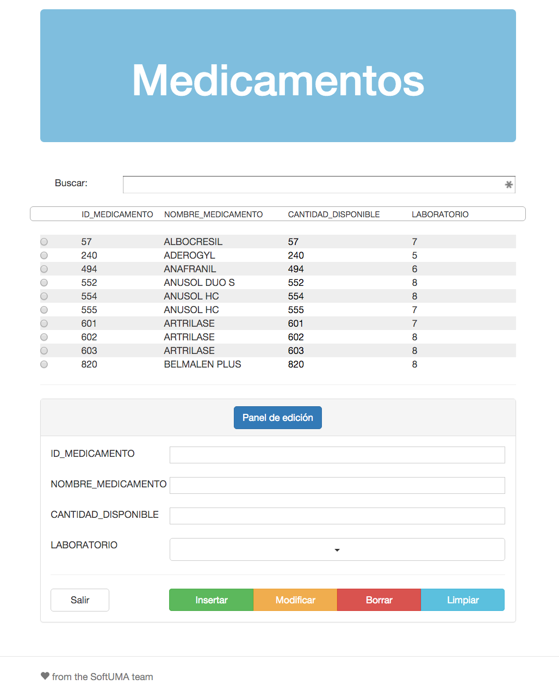
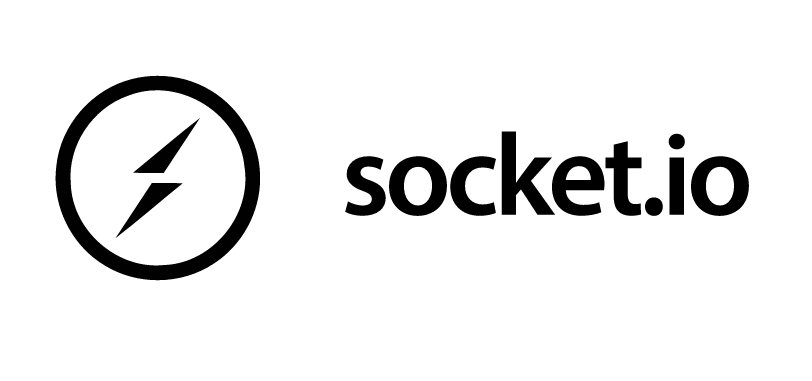

footer: © SoftUMA, 2015

# [fit] Object-Relational
# [fit] Mapping

---



# Tecnologías

- SQLite3
- Node.js
- Sequelize.js
- Express
- Socket.io
- Angular.js
- Bootstrap

---


# SQLite3

**Sistema Gestor de Base de Datos** (*SGDB*)

1. Transacciones *ACID*
1. Funciona sin servidor
1. Multiplataforma
1. Zer0-configuración

---


# Node.js

**Framework asincrono dirigido por eventos**

1. JavaScript nativo
1. API nativa
1. Basado en el motor **V8** de Chrome
1. Gestor de paquetes (*NPM*)

---


# Sequelize.js

**Mapeo Objeto-Relacional** (*ORM*)

1. Basado en *promesas*
1. Diversos dialectos
1. Transacciones sólidas
1. Node.js & io.js

---


# Express

**Web framework**

1. Mínimo y flexible
1. Web y móvil
1. Métodos HTTP (*REST*)
1. No aísla Node.js

---



# Socket.io

**Networking framework**

1. Bidireccional
1. Tiempo real
1. Basado en eventos
1. Web sockets

---


# Angular.js

**MVC framework**

1. Aplicaciones dinámicas
1. Web semántica
1. Extensible
1. Data-binding

---


# Bootstrap

**UI web framework**

1. Responsivo
1. Orientado a móvil
1. `Sass` & `Less`
1. jQuery plugins

---

# [fit] Sequelize.js

---

# Inicialización

```js
var Sequelize = require('sequelize');

var sequelize = new Sequelize('database.db', null, null, {
    dialect: 'sqlite',
    storage: 'data/database.db'
});
```

---

# [fit] Modelo

---

# Pantalla

```js
var Pantalla = sequelize.define('tPantalla', {
    pantalla: {
        type: Sequelize.STRING,
        primaryKey: true
    }
}, {
    freezeTableName: true,
    timestamps: false
});
```

---

# Rol

```js
var Rol = sequelize.define('tRol', {
    rolName: {
        type: Sequelize.STRING,
        primaryKey: true
    },
    rolDes: {
        type: Sequelize.STRING
    },
    admin: {
        type: Sequelize.BOOLEAN
    }
}, {
    freezeTableName: true,
    timestamps: false
});
```

---

# Permiso

```js
var Permiso = sequelize.define('tPermiso', {
    rolName: {
        type: Sequelize.STRING,
        primaryKey: true,
        references: {
            model: Rol,
            key: 'rolName'
        }
    },
    pantalla: {
        type: Sequelize.STRING,
        primaryKey: true,
        references: {
            model: Pantalla,
            key: 'pantalla'
        }
    },
    acceso: {
        type: Sequelize.BOOLEAN
    },
    modificacion: {
        type: Sequelize.BOOLEAN
    }
}, {
    freezeTableName: true,
    timestamps: false
});
```

---

# Usuario

```js
var Usuario = sequelize.define('tUsuario', {
    nombre: {
        type: Sequelize.STRING,
        primaryKey: true
    },
    password: {
        type: Sequelize.STRING
    },
    rolName: {
        type: Sequelize.STRING,
        references: {
            model: Rol,
            key: 'rolName'
        }
    }
}, {
    freezeTableName: true,
    timestamps: false
});
```

---

# Laboratorio

```js
var Laboratorio = sequelize.define('tLaboratorio', {
    ID_LABORATORIO: {
        type: Sequelize.INTEGER,
        primaryKey: true
    },
    NOMBRE_LABORATORIO: {
        type: Sequelize.STRING
    }
}, {
    freezeTableName: true,
    timestamps: false
});
```

---

# Medicamento

```js
var Medicamento = sequelize.define('tMedicamento', {
    ID_MEDICAMENTO: {
        type: Sequelize.INTEGER,
        primaryKey: true
    },
    NOMBRE_MEDICAMENTO: {
        type: Sequelize.STRING
    },
    CANTIDAD_DISPONIBLE: {
        type: Sequelize.INTEGER
    },
    LABORATORIO: {
        type: Sequelize.INTEGER,
        references: {
            model: Laboratorio,
            key: 'ID_LABORATORIO'
        }
    }
}, {
    freezeTableName: true,
    timestamps: false
});
```

---

# [fit] Queries

---

# select *

```js
Medicamento.findAll().then(function(result) {
  console.log(result);
}).catch(function(error) {
  console.log(error);
});
```

---

# select <attr>

```js
Usuario.findAll({
  where: {
    nombre: 'phil-fish'
  }
}).then(function(result) {
  console.log(result);
}).catch(function(error) {
  console.log(error);
});
```

---

# [fit] Manipulation

---

# insert

```js
Medicamento.create({
  ID_MEDICAMENTO: 42,
  NOMBRE_MEDICAMENTO: 'vicodin',
  CANTIDAD_DISPONIBLE: ∞,
  LABORATORIO: 'heisenberg-labs'
}).then(function(result) {
  console.log(result);
}).catch(function(error) {
  console.log(error);
});
```

---

# update

```js
Medicamento.update({
  ID_MEDICAMENTO: π,
  NOMBRE_MEDICAMENTO: 'morphine',
  CANTIDAD_DISPONIBLE: Φ,
  LABORATORIO: 'burns-biohazard-labs'
}, {
  where: {
    ID_MEDICAMENTO: 42
  }
}).then(function(result) {
  console.log(result);
}).catch(function(error) {
  console.log(error);
});
```

---

# delete

```js
Medicamento.destroy({
  where: {
    ID_MEDICAMENTO: 1337
  }
}).then(function(result) {
  console.log(result);
}).catch(function(error) {
  console.log(error);
});
```
